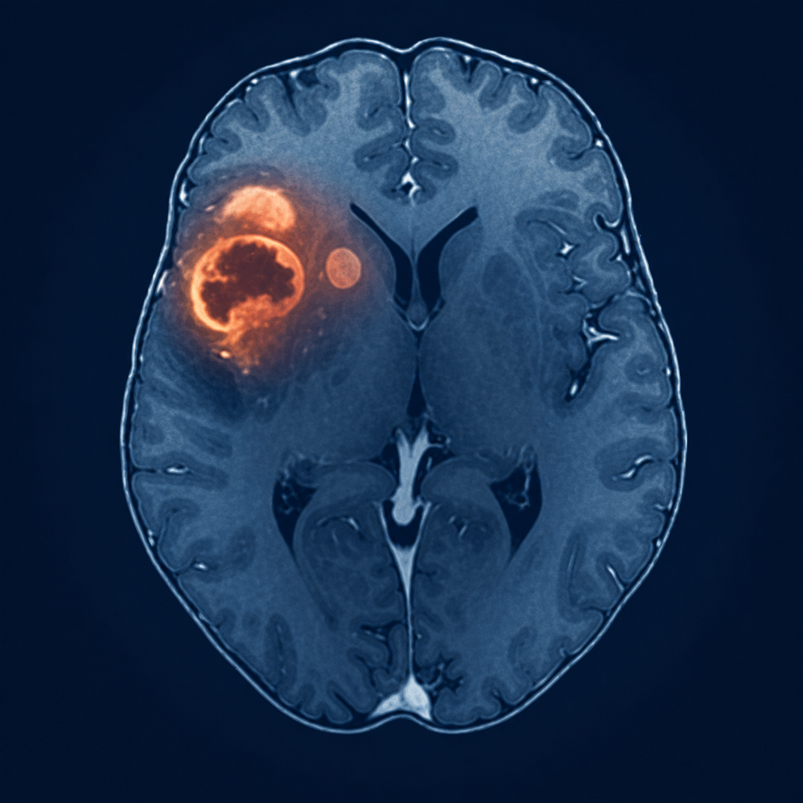
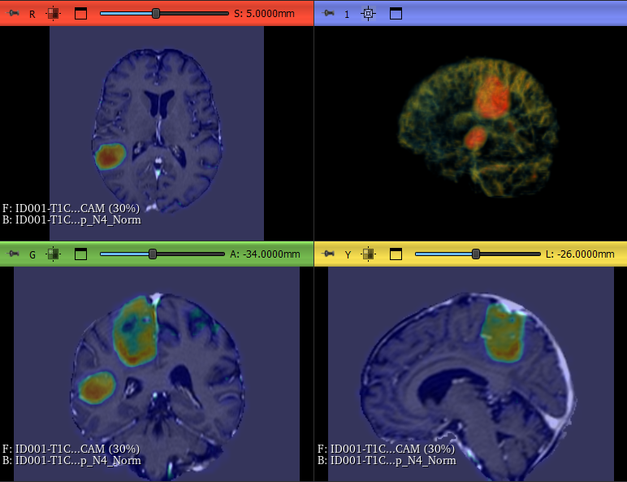
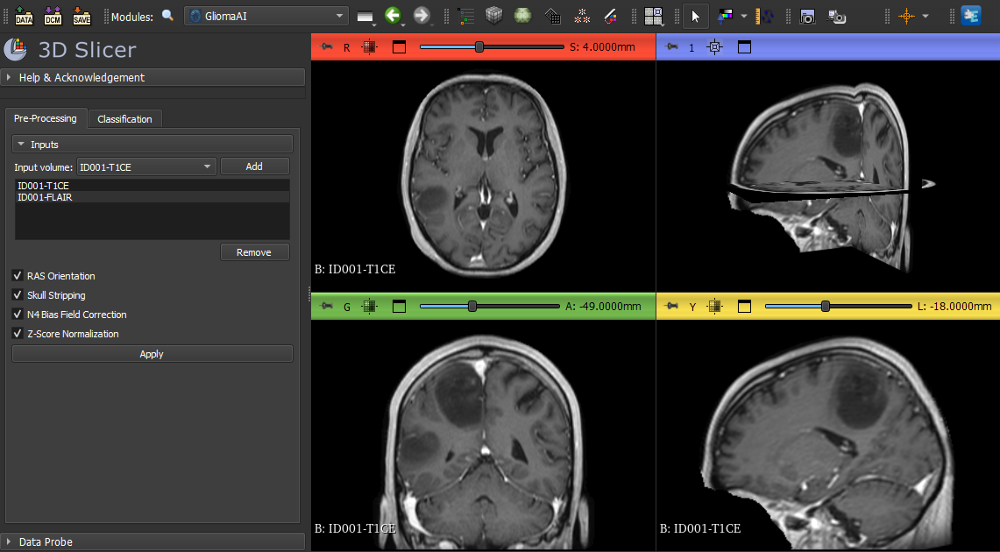
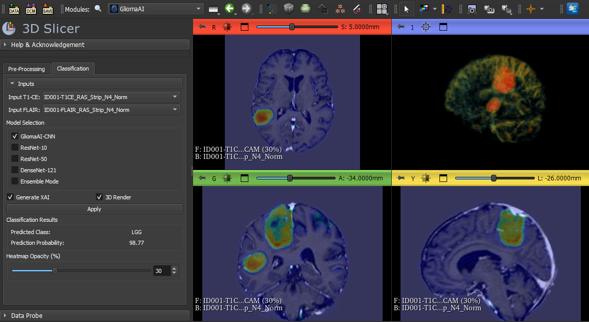

# GliomaAI

<p align="center">
  
</p>

GliomaAI is an open-source [3D Slicer](https://www.slicer.org/) extension for preprocessing preoperative brain MRI, classifying gliomas as low-grade (LGG; WHO grades 2–3) or high-grade (HGG; WHO grade 4), and visualizing model attention with Gradient-weighted Class Activation Mapping (Grad-CAM).

The extension is designed as a research-oriented decision-support tool. It runs pretrained 3D convolutional neural networks (CNNs) locally on a conventional CPU and does not require programming knowledge, manual tumor segmentation, or a GPU.

> [!IMPORTANT]
> GliomaAI is intended for research and educational use only. It is not a medical device, has not been approved for clinical diagnosis, and must not replace review by qualified healthcare professionals.



## Main features

- Preprocessing of up to four MRI volumes in one run.
- Support for T1-weighted contrast-enhanced (T1-CE), T2-weighted fluid-attenuated inversion recovery (FLAIR), or both modalities.
- Optional RAS reorientation, SynthStrip brain extraction, N4 bias-field correction, and z-score normalization.
- Segmentation-free LGG/HGG classification using four pretrained 3D CNNs.
- Ensemble inference through mean model probabilities.
- Grad-CAM generation for a selected individual model.
- Interactive 2D heatmap overlay with adjustable opacity.
- Direct 3D volume rendering of Grad-CAM activation.
- Local CPU inference; patient images are not uploaded by the extension.

## Contained module

### GliomaClassifier

`GliomaClassifier` is the extension's scripted module. Its **Pre-Processing** tab prepares MRI volumes and creates new MRML volume nodes, while its **Classification** tab performs CNN inference and optionally creates a Grad-CAM volume for 2D overlay and 3D rendering.

## Installation

### Extensions Manager

After the extension is accepted into the Slicer Extensions Index:

1. Open 3D Slicer.
2. Select **View > Extensions Manager**.
3. Search for **GliomaAI** and select **Install**.
4. Restart 3D Slicer when prompted.
5. Open **Informatics > GliomaAI** from the module selector.

### Manual installation for development

1. Clone or download this repository.
2. In 3D Slicer, open **Edit > Application Settings > Modules**.
3. Add the repository's `GliomaClassifier` directory to **Additional module paths**.
4. Restart 3D Slicer and open **Informatics > GliomaAI**.

## System requirements

| Requirement | Status |
| --- | --- |
| 3D Slicer | Tested with 5.6.2 and 5.12.0 stable; also tested with 5.13.0 preview |
| Operating system | Tested on 64-bit Windows; extension packages have also built successfully on Linux |
| Processor | 64-bit CPU; GPU is not required |
| Memory | 16 GB RAM used in the tested configuration |
| Storage | Several GB of free space are recommended for Python packages, cached models, and MRI volumes |
| Internet | Required during installation and the first use of dependencies or optional CNNs |
| MRI inputs | 3D scalar T1-CE and/or FLAIR volumes loadable by 3D Slicer |

TensorFlow and the NiPreps SynthStrip wrapper are installed into Slicer's Python environment when first required. The extension declares the Slicer `PyTorch` extension as a dependency and also checks that PyTorch can be imported before inference. A Slicer restart may be required after a first-time Python package installation.

The deployment has been tested with TensorFlow 2.19.1 and PyTorch 2.12.1 on CPU. SimpleITK, SciPy, NumPy, VTK, and Qt functionality are supplied through 3D Slicer or installed dependencies.

## Usage

### 1. Load the MRI volumes

Load the subject's T1-CE and/or FLAIR volumes into 3D Slicer. When both modalities are used, they must belong to the same examination and be spatially aligned. GliomaAI does not perform inter-modality registration.

### 2. Preprocess the images



1. Open the **Pre-Processing** tab.
2. Select a volume and click **Add**. Repeat for up to four volumes.
3. Select the required operations:
   - **RAS Orientation** reorients the image to Right-Anterior-Superior orientation.
   - **Skull Stripping** applies SynthStrip brain extraction.
   - **N4 Bias Field Correction** corrects low-frequency intensity non-uniformity and creates an additional difference volume for inspection.
   - **Z-Score Normalization** normalizes non-background brain intensities.
4. Click **Apply**.
5. Inspect the newly created output nodes in Slicer's Data module before classification.

All volumes are resampled to 1 mm isotropic spacing. Preprocessing creates new nodes and does not overwrite the original inputs.

### 3. Run classification



1. Open the **Classification** tab.
2. Select the preprocessed T1-CE and/or FLAIR output volumes.
3. Select one CNN, or enable **Ensemble Mode** and select multiple CNNs.
4. Optionally enable **Generate XAI** for Grad-CAM. XAI is available only for single-model inference.
5. Optionally enable **3D Render**. This also enables Grad-CAM generation.
6. Click **Apply**.
7. Review the predicted class and probability. If requested, inspect the Grad-CAM overlay and adjust **Heatmap Opacity (%)**.

Immediately before inference, each volume is centrally cropped or padded to `240 × 240 × 180` voxels and resized to the network input shape of `120 × 120 × 90`. If only one modality is supplied, the missing channel is filled with zeros. This reproduces the missing-modality strategy used during model development, but two-modality input is recommended when available.

## Available models

| User-facing name | Framework | Distribution | XAI |
| --- | --- | --- | --- |
| GliomaAI-CNN | TensorFlow/Keras | Included with the extension | Yes |
| ResNet-10 | PyTorch/TorchScript | Downloaded once from the project's GitHub release | Yes |
| ResNet-50 | PyTorch/TorchScript | Downloaded once from the project's GitHub release | Yes |
| DenseNet-121 | PyTorch/TorchScript | Downloaded once from the project's GitHub release | Yes |
| Ensemble Mode | Mean of selected model probabilities | Uses the selected models | No |

Downloaded model files are verified against their published SHA-256 checksums before use.

## Outputs

- One preprocessed scalar volume per input MRI.
- An N4 difference volume when N4 correction is enabled.
- Predicted class: `LGG` or `HGG`.
- Probability of the predicted class, displayed as a percentage.
- A scalar Grad-CAM volume named `<reference-volume>_GradCAM` when XAI is enabled.
- Optional 3D volume rendering of the Grad-CAM activation.

Grad-CAM indicates regions that influenced a model prediction. It is not a tumor segmentation and should not be interpreted as a delineation of tumor boundaries.

## Data handling and downloads

MRI processing and inference occur locally inside 3D Slicer. GliomaAI does not transmit MRI volumes or predictions. Internet access is used only to install declared Python dependencies and to download optional pretrained models from the project's GitHub release when they are first selected.

## Known limitations

- Research use only; clinical safety and diagnostic effectiveness have not been established.
- The current task is binary LGG (G2–3) versus HGG (G4) classification.
- Inputs are expected to be preoperative 3D T1-CE and/or FLAIR brain MRI.
- When both modalities are supplied, correct subject pairing and spatial alignment are the user's responsibility.
- GPU execution is not currently enabled by the extension; inference runs on CPU.
- Grad-CAM is a model-attention visualization and not a segmentation result.
- Performance may vary with scanner, protocol, population, artifacts, or pathology distributions that differ from the development cohorts.

## Publication and citation

The model development, preprocessing strategy, datasets, training procedure, and validation are described in:

> Andrianos, C.C.; Kostopoulos, S.A.; Kalatzis, I.K.; Glotsos, D.T.; Asvestas, P.A.; Cavouras, D.A.; Athanasiadis, E.I. Segmentation-Free Preoperative 3D MRI Classification of Low-Grade Versus High-Grade Glioma Using Task-Oriented Neural Architecture Search. *Journal of Imaging* **2026**, *12*, 254. [https://doi.org/10.3390/jimaging12060254](https://doi.org/10.3390/jimaging12060254)

```bibtex
@article{Andrianos2026Glioma,
  author  = {Andrianos, Christos Ch. and Kostopoulos, Spiros A. and Kalatzis, Ioannis K. and Glotsos, Dimitris Th. and Asvestas, Pantelis A. and Cavouras, Dionisis A. and Athanasiadis, Emmanouil I.},
  title   = {Segmentation-Free Preoperative 3D MRI Classification of Low-Grade Versus High-Grade Glioma Using Task-Oriented Neural Architecture Search},
  journal = {Journal of Imaging},
  year    = {2026},
  volume  = {12},
  number  = {6},
  article-number = {254},
  doi     = {10.3390/jimaging12060254}
}
```

SynthStrip users should also cite:

> Hoopes, A.; Mora, J.S.; Dalca, A.V.; Fischl, B.; Hoffmann, M. SynthStrip: Skull-Stripping for Any Brain Image. *NeuroImage* **2022**, *260*, 119474. [https://doi.org/10.1016/j.neuroimage.2022.119474](https://doi.org/10.1016/j.neuroimage.2022.119474)

## License and third-party software

GliomaAI source code and project-trained model files are distributed under the [MIT License](LICENSE.txt). Third-party components retain their respective licenses; see [THIRD_PARTY_NOTICES.md](THIRD_PARTY_NOTICES.md) and the files in `licenses/`.

## Maintainer

Christos Ch. Andrianos<br>
Department of Biomedical Engineering, University of West Attica, Athens, Greece

Issues and reproducible bug reports can be submitted through the repository's [GitHub Issues](https://github.com/xristosand/SlicerGliomaAI/issues) page.
